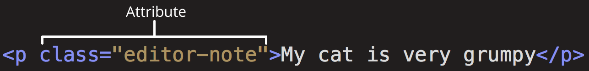
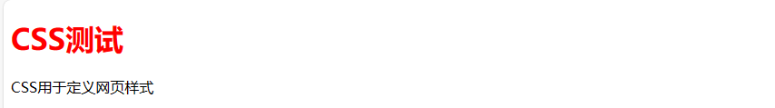
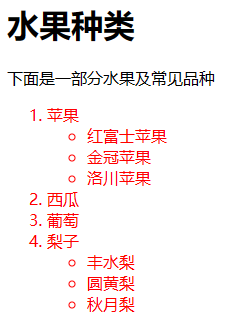
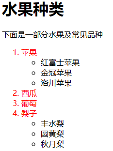
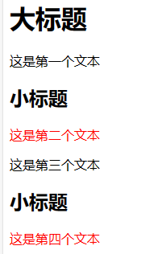
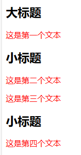
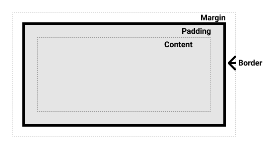

---
html:
  embed_local_images: true
  embed_svg: true
  offline: false

print_background: true

export_on_save:
  html: true
---

# Web学习笔记
<p id=head>:)</p>

## 相关网站

- [MDN](https://developer.mozilla.org/zh-CN/docs/Learn/Getting_started_with_the_web)
- [CSS参考](https://developer.mozilla.org/zh-CN/docs/Web/CSS/Reference)
- [学习进度](https://developer.mozilla.org/zh-CN/docs/Learn/CSS/Building_blocks/Backgrounds_and_bordershttps://developer.mozilla.org/zh-CN/docs/Learn/CSS/Building_blocks/Backgrounds_and_borders)
- [HTML语法检查](https://validator.w3.org/)
- [渐变背景生成](https://cssgradient.io/)
## HTML

### 前言
HTML是一种由不同元素组成的标记语言，应用于文本，赋予文本不同的含义（它是段落吗？它是项目列表吗？它是表格吗？），将文档结构化为逻辑块（文档是否有头部？有三列内容？有一个导航菜单？）或嵌入非文本文件（图片、音频）。元素由开始标签、内容、结束标签三部分组成。

<center>
    
</center>


### 入门前知识
#### 元素类型
##### 块级元素
块级元素在页面中以块的形式展现。一个块级元素出现在它前面的内容之后的新行上。任何跟在块级元素后面的内容也会出现在新的行上。块级元素通常是页面上的结构元素。例如，一个块级元素可能代表标题、段落、列表、导航菜单或页脚。一个块级元素不会嵌套在一个内联元素里面，但它可能嵌套在另一个块级元素里面。

##### 内联元素
内联元素通常出现在块级元素中并环绕文档内容的一小部分，而不是一整个段落或者一组内容。内联元素不会导致文本换行。它通常与文本一起使用，例如，`<a>` 元素创建一个超链接，`<em>` 和 `<strong>` 等元素创建强调。


##### 空元素
一些元素只有一个标签，通常用来在此元素所在位置插入/嵌入一些东西。这些元素被称为空元素。（如``）

*例：*
```html
<p>文本一</p><p>文本二</p><p>文本三</p>

<b>文本四</b>
<b>文本五</b>
<b>文本六</b>
```
*输出：*
<center>
    
</center>

>在这篇文章中提到的“块”和“内联”，不应该与 CSS 盒子的类型中的同名术语相混淆。尽管它们默认是相关的，但改变 CSS 显示类型并不会改变元素的分类，也不会影响它可以包含和被包含于哪些元素。防止这种混淆也是 HTML5 摒弃这些术语的原因之一。

#### 元素属性
属性包含元素的额外信息，这些信息不会出现在实际的内容中。在上述例子中，这个 class 属性是一个识别名称，以后为元素设置样式信息时更加方便。

<center>
    
  
</center>
<br>

属性名称必须包含：

- 一个空格，它在属性和元素名称之间。如果一个元素具有多个属性，则每个属性之间必须由空格分隔。
- 属性名称，后面跟着一个等于号。
- 一个属性值，由一对引号（""）引起来。


#### HTML文档结构
```html
<!doctype html>   
<html lang="zh-CN">
  <head>
    <meta charset="utf-8" />
    <title>我的测试站点</title>
  </head>
  <body>
    <p>这是我的页面</p>
  </body>
</html>

```
`<!DOCTYPE html>`
声明文档类型，文档类型声明类似于链接，规定了 HTML 页面必须遵从的良好规则，能自动检测错误和其他有用的东西。需要包含它才能使其他东西正常工作。`<!DOCTYPE html>` 是最短的有效文档声明。

`<html>`
这个元素包裹了页面中所有的内容，有时被称为根元素。

`<head>`
这个元素是一个容器，它包含了所有你想包含在 HTML 页面中但不在 HTML 页面中显示的内容。这些内容包括你想在搜索结果中出现的关键字和页面描述、CSS 样式、字符集声明等等。

`<meta>`
这个元素代表了不能由其他 HTML 元相关元素表示的元数据，比如 `<base>`、`<link>`、`<script>`、`<style>` 或 `<title>`。`charset` 属性将文档的字符集设置为 UTF-8，其中包括绝大多数人类书面语言的大多数字符。有了这个设置，页面现在可以处理它可能包含的任何文本内容。

`<title>`
元素。这设置了页面的标题，也就是出现在该页面加载的浏览器标签中的内容。当页面被加入书签时，页面标题也被用来描述该页面。

`<body>`
元素。包含了你访问页面时所有显示在页面上的内容，包含文本、图片、视频、游戏、可播放音频轨道等等。


### 文本处理基础

#### 标题和段落
在HTML中，一共有六种标题元素标签——h1、h2、h3、h4、h5 和 h6。每个元素代表文档中不同级别的内容：`<h1>` 表示主标题，`<h2>` 表示二级子标题，`<h3>` 表示三级子标题，依此类推。每个段落是通过 `<p>` 元素标签进行定义的。

注意：
- 最好只对每个页面使用一次 `<h1>`——这是顶级标题，所有其他标题位于层次结构中的下方。
- 请确保在层次结构中以正确的顺序使用标题。不要使用 `<h3>` 来表示副标题，后面再跟 `<h2>` 来表示二级副标题——这是没有意义的，会导致奇怪的结果。
- 在现有的六个标题层次中，除非觉得有必要，否则应该争取每页使用不超过三个。

#### 列表

##### 无序列表
无序列表用于标记列表项目顺序无关紧要的列表
*例：*
```html
<ul>
  <li>时间</li>
  <li>地点</li>
  <li>人物</li>z
</ul> 
```

*输出：*
<ul>
  <li>时间</li>
  <li>地点</li>
  <li>人物</li>
</ul> 

##### 有序列表
有序列表用于标记列表项目顺序重要的列表
*例：*
```html
<ol>
  <li>直行100米</li>
  <li>右转</li>
  <li>直行20米</li>
</ol> 
```

*输出：*
<ol>
  <li>直行100米</li>
  <li>右转</li>
  <li>直行20米</li>
</ol> 

##### 描述列表*
描述列表常用于一个或一组专业名词、答案的解释。描述列表使用与其他列表类型不同的闭合标签——`<dl>`；此外，每一项都用`<dt>`（description term）元素闭合。每个描述都用`<dd>`（description definition）元素闭合。
*例：*
```html
<dl>

<dt>培根</dt>
<dd>整个世界的粘合剂。</dd>
<dt>鸡蛋</dt>
<dd>一块蛋糕的粘合剂。</dd>
<dt>咖啡<dt>
<dd>一种浅棕色的饮料。</dd>
<dd>可以在清晨带来活力。</dd>

</dl>
``` 
*输出：*
<dl>
<dt>培根</dt>
<dd>整个世界的粘合剂。</dd>
<dt>鸡蛋</dt>
<dd>一块蛋糕的粘合剂。</dd>
<dt>咖啡<dt>
<dd>一种浅棕色的饮料。</dd>
<dd>可以在清晨带来活力。</dd>
</dl>

#### 重点强调

##### 强调

`<em>`（emphasis）
浏览器默认样式为斜体，并可以被屏幕阅读器识别，以不同的语调发出。

##### 强烈的重要性

`<strong>`（strong importance）
浏览器默认样式为粗体，并可以被屏幕阅读器识别，以不同的语调发出。

##### 斜体、粗体、下划线
`<i>`
被用来传达传统上用斜体表达的意义：外国文字，分类名称，技术术语，一种思想...
`<b>`被用来传达传统上用粗体表达的意义：关键字，产品名称，引导句...

`<u>`被用来传达传统上用下划线表达的意义：专有名词，拼写错误...

### 文档与网站架构

#### 文档的基本组成部分
网页的外观一般由下面的版块组成：

<dl>
<dt>页眉</dt>
<dd>通常横跨于整个页面顶部有一个大标题 和/或 一个标志。这是网站的主要一般信息，通常存在于所有网页。</dd>

<dt>导航栏</dt>
<dd>指向网站各个主要区段的超链接。通常用菜单按钮、链接或标签页表示。类似于标题栏，导航栏通常应在所有网页之间保持一致，否则会让用户感到疑惑，甚至无所适从。许多 web 设计人员认为导航栏是标题栏的一部分，而不是独立的组件，但这并非绝对；还有人认为，两者独立可以提供更好的 无障碍访问特性，因为屏幕阅读器可以更清晰地分辨二者。</dd>

<dt>主内容</dt>
<dd>中心的大部分区域是当前网页大多数的独有内容，例如视频、文章、地图、新闻等。这些内容是网站的一部分，且会因页面而异。</dd>

<dt>侧边栏</dt>
<dd>一些外围信息、链接、引用、广告等。通常与主内容相关（例如一个新闻页面上，侧边栏可能包含作者信息或相关文章链接），还可能存在其他的重复元素，如辅助导航系统。</dt>

<dt>页脚</dt>
<dd>横跨页面底部的狭长区域。和标题一样，页脚是放置公共信息（比如版权声明或联系方式）的，一般使用较小字体，且通常为次要内容。还可以通过提供快速访问链接来进行<a href="https://developer.mozilla.org/zh-CN/docs/Glossary/SEO">SEO</a>。</dd>
</dl>

为了实现语义化标记，HTML 提供了明确这些区段的专用标签，例如：

- `<header>`：页眉。
- `<nav>`：导航栏。
- `<main>`：主内容。主内容中还可以有各种子内容区段，可用`<article>`、`<section>` 和 `<div>` 等元素表示。
- `<aside>`：侧边栏，经常嵌套在 `<main>` 中。
- `<footer>`：页脚。


### 常用标签


#### \<a>：锚元素

常用属性如下：
`href`
声明需要跳转的目标位置。
`title`
跳转提示（鼠标放置在跳转文本上方时触发）
`target`
指定打开方式。如target="_blank"，表明在新标签页打开。

>统一资源定位符（URL）与路径（path）
统一资源定位符（Uniform Resource Locator，URL）是一个定义了在网络上的位置的一个文本字符串。例如，Mozilla 的简体中文主页位于 https://www.mozilla.org/zh-CN/。

##### 链接到HTML网页
*例一：*
```html
<!--文本链接到bing-->
<a href="https://www.bing.com" title="跳转到Bing" target="_blank">bing</a> 
```
*输出：*
<a href="https://www.bing.com" title="跳转到Bing" target="_blank"><b>bing</b></a>


*例二：*
```html
<!--用图片链接到bing-->
<a href="https://www.bing.com" title="跳转到Bing" target="_blank">
    
</a> 
```
*输出：*
<a href="https://www.bing.com" title="跳转到Bing" target="_blank">
    <center>
        
    </center> 
</a> 

##### 跳转到HTML网页的某个位置
如果需要跳转到当前网页的某个位置，需要给要链接到的元素分配一个 id 属性
```html
<a id=head>:)</a>  <!--将代码放置于需要被跳转的位置-->
```
再对使用`#`+`锚点名称`使用锚点
```html
<p><a href="#head">跳转到标题</a></p> <!--将代码放置于需要跳转的位置-->
```
*输出：*
<p><a href="#head">跳转到标题</a></p>

如果要跳转到其他网页的某个位置，需要在跳转路径中加入`被跳转的网页路径`+`#`+`锚点名称`

*例：*
```html
<!--作业1.html-->
<!doctype html> 
<html lang="zh-CN">
    <head>
        <meta charset="utf-8" />
        <title>我的测试站点</title>
    </head>
    <body>
        <h1>作业1</h1>
        <P>这是我<b>第一次</b>作业</P>
        <p id="anc_work">我是在学了<a href="https://developer.mozilla.org/zh-CN/docs/Learn/HTML/Introduction_to_HTML/Getting_started" title="点击跳转到MDN" target="_blank">web 入门</a>后开始这个作业</p>
    </body>
</html>
```
在跳转位置使用锚点

```html
  <p><a href="coursework/作业1.html#anc_work">跳转到作业1</a></p>
```


<p><a href="coursework/作业1.html#anc_work" target="_blank">跳转到作业1</a></p>

<a id="audio"></a>
#### \<audio>
*相关标签* 
<p><a href="#video">&ltvideo&gt</a></p>

---


#### \<div>:无语义元素
对于一些要组织的项目或要包装的内容，现有的语义元素均不能很好对应。用于作为一个单独的实体来修饰来响应单一的用 CSS 或 JavaScript。通过在其中插入 <figcaption>（作为第一个或最后一个子元素），可以将标题与 `<figure>` 元素相关联。图中找到的第一个`<figcaption>`元素显示为图的标题。

>与`<span>`不同的是，`<div>`是块级元素（block）

<p><a id=figure></a></p>

#### \<figure>:可附标题内容元素

**相关标签**
- <p><a href="#img">&ltimg&gt</a></p>
- <p><a href="#responsive">响应式图片设计</a></p>
---


`<figure>`元素代表一段独立的内容，可能包含`<figcaption>`元素定义的说明元素。该插图、标题和其中的内容通常作为一个独立的引用单元。通常，`<figure>` 的内容为图像、插图、图表、代码片段等，在文档的主内容流中引用，但可以移动到文档的另一部分或附录而不影响主内容流。
>\<figcaption> 元素 是与其相关联的图片的说明/标题，用于描述其父节点\<figure> 元素里的其他数据。

*例：*
```html
<figure>

  <blockquote>
      我们因为无知而读书，而我们读书让我们更加地觉得自己的无知。
  </blockquote>
  <figcaption><b>罗翔</b></figcaption>
</figure>
```
*输出：*


<p><a id=img></a></p>

#### \：图像嵌入元素


**相关连接**
- <p><a href="#figure">&ltfigure&gt</a></p>
- <p><a href="#responsive">响应式图片设计</a></p>
---
用于插入一张图片，常规用法如例1所示：
*例1：*
```html
 
<!--alt值为文件无法访问时的描述文本-->
```
<dl>
  <dt>alt属性</dt>
  <dd>当图片不能正常显示时显示的文本内容</dd>
  <dt>title属性</dt>
  <dd>图片辅助说明文本，鼠标放置于图片上方触发</dd>

  <dt>heigh/width</dt>
  <dd>图片高度/宽度</dd>

</dl>

*输出：*
<center>
    
</center>


*例2：*

```html

```


#### \<link>：外部资源链接元素
规定了当前文档与外部资源的关系。该元素最常用于链接样式表

#### \<meta>：元数据
元数据就是描述数据的数据

#### \<picture> 
- <p><a href="#img">&ltimg&gt</a></p>
- <p><a href="#responsive">响应式图片设计</a></p>
---
`<picture> `元素包含了一些`<source>`元素，它使浏览器在不同资源间做出选择，紧跟着的是最重要的``元素。


```html
<picture>
  <source media="(max-width: 800px)" srcset="../Images/2-3000.jpg">
  <source media="(min-width: 800px)" srcset="../Images/1-5000.jpg" >
  
</picture>

```


#### \<span>:无语义元素
是短语内容的通用行内容器，并没有任何特殊语义。
>与`<div>`不同的是，`<span>`是内联（inline）无语义元素。

<a id="video"></a>
#### \<video>元素
*相关标签*
<p><a href="#audio">&lt audio&gt</a>

---

用于嵌入视频，它的简单用法如例1所示
*例1：*
```html
<video src="Images/firework.mp4" 
       width=500
       controls>
    <p>
      你的浏览器不支持 HTML5 视频。可点击<a href="Images/firework.mp4">此链接</a>观看
    </p>
</video>
```
<center>
<video src="Images/firework.mp4" 
       width=500
       controls>
    <p>
      你的浏览器不支持 HTML5 视频。可点击<a href="Images/firework.mp4">此链接</a>观看
    </p>
</video>
</center>

>在VScode+Markdown Preview Enhanced v0.8.11环境下预览无法播放视频，原因是临时预览文件的文件夹位置发生变动，使目标地址发生更改。在md生成的Html页面中能正常播放。

在不支持 video 元素的浏览器中，\<video>\</video> 标签中间的内容会显示，作为降级处理。常用属性如下：
<dl>
  <dt>src<dt>
  <dd>要嵌到页面的视频的URL。可以使用 &ltvideo&gt元素块内的&ltsource&gt元素来指定需要嵌到页面的视频。</dd>
  <dt>width/height<dt>
  <dd>指定视频宽度/高度</dd>
  <dt>autoplay</dt>
  <dd>布尔属性，声明该属性后，视频会尽快自动开始播放</dd>
  <dt>controls</dt>
  <dd>加上这个属性，浏览器会在视频底部提供一个控制面板，允许用户控制视频的播放，包括音量，跨帧，暂停/恢复播放。如果没有指定 controls 属性，那么视频不会展示浏览器自带的控件。</dd>
  <dt>loop</dt>
  <dd>布尔属性；指定后，会在视频播放结束的时候，自动返回视频开始的地方，继续播放。</dd>
  <dt>muted</dt>
  <dd>布尔属性，指明在视频中音频的默认设置。设置后，音频会初始化为静音。默认值是 false, 意味着视频播放的时候音频也会播放。</dd>
  <dt>poster</dt>
  <dd>海报帧图片 URL，用于在视频处于下载中的状态时显示。如果未指定该属性，则在视频第一帧可用之前不会显示任何内容，然后将视频的第一帧会作为海报（poster）帧来显示。</dd>

</dl>

>如果使用 autoplay="false" 来关闭视频的自动播放功能，会不起作用；只要 `<video>` 标签中有 autoplay 属性，视频就会自动播放。

*例2：*
```html
<video controls  loop  width="500"  poster="Images/image-3.png">
  <source src="Images/firework.mp4"/>
  抱歉，你的浏览器不支持内嵌视频!
</video>
```

<center>
  <video controls  loop  width="500"  poster="Images/image-3.png">
    <source src="Images/firework.mp4"/>
    抱歉，你的浏览器不支持内嵌视频!
  </video>
</center>

>播放前视频尺寸为poster指向图片的尺存


## CSS

### 前言
CSS （Cascading Style Sheets，层叠样式表）是用来控制网页在浏览器中的显示外观的声明式语言。浏览器会根据 CSS 的样式定义将其选定的元素显示为恰当的形式。一条 CSS 的样式定义包括属性和属性值，它们共同决定网页的外观。

### 入门前知识

#### 调用CSS
假设现在需要调用样式表`test2_style.css`,只需在HTML中`<head>`元素内使用<Link>元素：

```html
 <link href="test2_style.css" rel="stylesheet">
```
属性 `rel`让浏览器知道有 CSS 文档存在，属性 `href` 指定 CSS 文件的位置。
#### CSS的语法
语法由一个选择器（selector）起头。它选择了我们将要用来添加样式的 HTML 元素。在这个例子中我们为一级标题（主标题`<h1>` 添加样式,在大括号内部定义一个或多个形式为`属性：值`的声明。
*例1：* <a id="CSS的语法"></a>
```css
/* test2_style.css */
h1{
    color: red;
}
```
```html
<!-- html文件 -->
<!doctype html> 
<html lang="zh-CN">
    <head>
        <meta charset="utf-8" />
        <title>测试2</title>
        <!-- 引用样式表test2_style.css -->
        <link href="test2_style.css" rel="stylesheet">   
    </head>
    <body>
        <h1>CSS测试</h1>
        <p>CSS用于定义网页样式</p>
    </body>
</html>

```

*例1输出：*
<center>
  
</center>

### 选择器分类
#### 元素选择器
指直接匹配 HTML 元素的选择器（见<a href="#CSS的语法">例1</a>）

#### 伪元素选择器
其表现为往标记文本中加入全新的 HTML 元素一样，和伪类相似。
常用伪元素：

`::before`（`::after`）- 常通过 content 属性来为一个元素添加修饰性的内容。此元素默认为行内元素。


#### 类选择器
使用元素选择器会导致同一个元素下的内容都一个样式，不能满足多样化设计，我们可以给 HTML 元素加个类名（class），再选中那个类名：

*例2：* <a id="CSS的语法例2"></a>
```html
<p calss="class1">这是文本</p>
```
在CSS中，只需要在选择器前加上小数点即可：
```css
.class1{
  font-weight: bold;
}
```
如果多个选择器的样式相同，可用逗号（“,”）连接，进行选择器多选：

```css
h1,
h2,
p.class1{

}
```

#### 伪类选择器(状态选择器)
状态选择器（也称为伪类选择器）在CSS中用于定义元素的特定状态下的样式。这些状态可以是用户与元素交互时的状态，如悬停、聚焦、点击等。

常用的状态选择器有：
`:hover` - 当用户鼠标悬停在元素上时，应用的样式。
`:active` - 当元素被点击时，应用的样式。
`:focus` - 当元素获得焦点时（例如，通过点击或使用键盘导航），应用的样式。
`:visited` - 仅用于链接，当链接已被访问时，应用的样式。
`:link` - 仅用于未被访问的链接。
`:checked` - 用于单选按钮、复选框等输入元素，当元素被选中时，应用的样式。
`:disabled` - 当元素被禁用时，应用的样式。

`:first-child`- 表示在一组兄弟元素中的第一个元素。

#### 组合选择器（交集选择器）
就是两个不同的选择器一起用。在<a href="#CSS的语法例2">例2</a>中，若要选择使用类`calss1`的所有元素`<p>`，则应该写成：
```css
p.class1{
    font-weight: bold;
}
```

#### 后代选择器与子代选择器
假设仅选择嵌套在`<li>`元素内的`<em>`我们可以使用一个称为包含选择符的选择器（后代选择器），它只是单纯地在两个选择器之间加上一个空格。子代选择器只能选择元素的子代，而他的孙代、曾孙不能被选上，后代选择器可以选子代、孙代、曾孙的元素。

*例：*
```html
<!doctype html> 
<html lang="zh-CN">
    <head>
        <meta charset="utf-8">
        <title>test3:后代选择器与子代选择器的区别</title>
        <link href="test3.css" rel="stylesheet">
    </head>
    <body>
        <h1>水果种类</h1>

        <p>下面是一部分水果及常见品种</p>
        <ol>
            <li>苹果</li>
                <ul>
                    <li>红富士苹果</li>
                    <li>金冠苹果</li>
                    <li>洛川苹果</li>
                </ul>
            <li>西瓜</li>
            <li>葡萄</li>
            <li>梨子</li>
                <ul>
                    <li>丰水梨</li>
                    <li>圆黄梨</li>
                    <li>秋月梨</li>
                </ul>
        </ol>
    </body>

</html>
```

```css
/* 后代选择器 */
oi em{
  color: rebeccapurple;
}


/* 子代选择器 */
oi > em{
  color: rebeccapurple;
}
```
效果如下


<table>
  <tr>
      <td></td>
      <td></td>
  </tr>
  
  <tr>
      <td><center>图1 后代选择器</center></td>
      <td><center>图2 子代选择器</center></td>
  </tr>
</table>


#### 兄弟选择器

##### 相邻兄弟选择器
它选择紧接在另一个元素之后的元素，且两者有相同的父元素，只有当element2紧跟在element1后面时，element2才会被选中并应用样式。
例：

```html
<body>
    <h1>大标题</h1>
    <p>这是第一个文本</p>
    <h2>小标题</h2>
    <p>这是第二个文本</p>
    <p>这是第三个文本</p>
    <h2>小标题</h2>
    <p>这是第四个文本</p>
</body>
```

```css
h2 + p{
  color:red;
}
```
*输出：*

<center>
  
</center>

##### 通用兄弟选择器 
如果我们想要选中所有跟在\<h2>元素后面的\<p>元素，并改变它们的颜色为蓝色，我们可以使用通用兄弟选择器：
*例：*
```html
<body>
    <h2>大标题</h2>
    <p>这是第一个文本</p>
    <h2>小标题</h2>
    <p>这是第二个文本</p>
    <p>这是第三个文本</p>
    <h2>小标题</h2>
    <p>这是第四个文本</p>
</body>
```

```css
h2 ~ p{
  color:red;
}
```
*输出：*
<center>
  
</center>

#### 全局选择器
全局选择器，是由一个星号（*）代指的，它选中了文档中的所有内容（或者是父元素中的所有内容，比如，它紧随在其他元素以及邻代运算符之后的时候）。

### 层叠、优先级与继承

####  选择器的优先级

浏览器是根据优先级来决定当多个规则有不同选择器对应相同的元素的时候需要使用哪个规则。它基本上是一个衡量选择器具体选择哪些区域的尺度

>类选择器和元素选择器之间存在冲突，类选择器优先；元素选择器之间存在冲突，后一个规则优先。但是，内联样式优先级更高

##### 优先级的计算
在一些情况下，有些规则在最后出现，但是却应用了前面的具有冲突的规则。这是因为前面的有更高的优先级。本质上，不同类型的选择器有不同的分数值，把这些分数相加就得到特定选择器的权重，然后就可以进行匹配。

一个选择器的优先级可以说是由三个不同的分量相加，可以认为是百（ID）十（类）个（元素）——三位数的三个位数：
- ID：选择器中包含 ID 选择器则百位得一分。
- 类：选择器中包含类选择器、属性选择器或者伪类则十位得一分。
- 元素：选择器中包含元素、伪元素选择器则个位得一分。
  
>备注： 通用选择器（*）、组合符（+、>、~、' '）和调整优先级的选择器（:where()）不会影响优先级。
#### 继承
一些设置在父元素上的 CSS 属性是可以被子元素继承的。

优点|缺点
--- | ---
继承可以简化代码，降低css样式的复杂性。| 如果在网页中所有的元素都大量使用继承样式，那么判断样式的来源就会很困难。


#### 层叠
层叠是 CSS 的一个基本特征，它是一个定义了如何合并来自多个源的属性值的算法,它通过挑选 CSS 声明来给 CSS 属性设置正确的值。是为了解决样式冲突（一个标签指定了相同样式）而存在的。

步骤如下：
1. **相关声明**：找到所有具有匹配每个元素的选择器的声明代码块。
2. **重要性**：根据规则是普通还是重要对规则进行排序。重要的样式是指设置了 `!important (en-US)` 标志的样式。
3. **来源**：在两个按重要性划分的分组内，按作者、用户或用户代理这几个来源对规则进行排序。
4. **层**：在六个按重要性和来源划分的分组内，按层叠层进行排序。普通声明的层顺序是从创建的第一个到最后一个，然后是未分层的普通样式。对于重要的样式，这个顺序是反转的，但保持未分层的重要样式优先权最低。
5. **优先级**：对于来源层中优先权相同的竞争样式，按优先级对声明进行排序。
6. **出现顺序**：当两个来源层的优先权相同的选择器具有相同的优先级时，最后声明的具有最高优先级的选择器的属性值获胜。


##### 层叠顺序
<center>

| 来源 | 重要程度 |  |
|---|---|---|
| 1 | 用户代理 | 普通 |
| 2 | 用户 | 普通 |
| 3 | 页面作者 | 普通 |
| 4 | CSS 动画 | 见下节 |
| 5 | 页面作者 | !important |
| 6 | 用户 | !important |
| 7 | 用户代理 | !important |
| 8 | css 过渡 (css transitions) |  |
</center>

- **用户代理样式(用户代理样式表**)：浏览器中一有个基本的样式表来给任何网页设置默认样式。
- **网页的作者(作者样式表)**：网页的作者可以定义文档的样式。
- **用户(用户样式表)**：作为浏览器的用户，可以使用自定义样式表定制使用体验。

>用 \<style> 元素直接在元素上声明的样式是作者样式。

对于每个属性，“获胜”的声明是来自基于权重（普通或重要）具有优先权的来源的声明。来自具有最高优先权的来源的值将被应用。如果获胜来源对于一个元素有多个属性声明，那么将比较这些竞争属性值的选择器的优先级。不同来源之间的选择器从不比较优先级。当具有优先权的来源中竞争的声明具有相同的优先级时，出现顺序才变得相关。

##### 层叠层

类似于我们有六个基于来源和重要性的优先权级别，层叠层使我们能够在这些来源中创建子来源级别的优先权。

在六个来源中的每一个，都可以有多个层叠层。层创建的顺序非常重要。层创建的顺序确定了同一来源内层的优先权顺序。

在普通来源中，层按照创建的顺序排序。优先权顺序是从首个创建的层到最后一个层，然后是未分层的普通样式。

对于重要样式，这个顺序是相反的。所有未分层的重要样式会层叠在一起，形成一个隐式层，优先权高于所有非过渡的普通样式。未分层的重要样式的优先权低于任何重要分层样式。在同一来源内，先前声明的层中的重要样式优先于后续声明的层中的重要样式。


### 盒模型

#### 块级盒子（Block box）和 内联盒子（Inline box）

**块级盒子**
  - 盒子会在内联的方向上扩展并占据父容器在该方向上的所有可用空间，在绝大数情况下意味着盒子会和父容器一样宽
  - 每个盒子都会换行
  - width 和 height 属性可以发挥作用
  - 内边距（padding）, 外边距（margin）和 边框（border）会将其他元素从当前盒子周围“推开”

**内联盒子**
  - 盒子不会产生换行。
  - width 和 height 属性将不起作用。
  - 垂直方向的内边距、外边距以及边框会被应用但是不会把其他处于 inline 状态的盒子推开。
  - 水平方向的内边距、外边距以及边框会被应用且会把其他处于 inline 状态的盒子推开。

我们通过对盒子`display` 属性的设置来控制盒子的外部显示类型。

##### 补充：inline-block
`display` 有一个特殊的值，它在内联和块之间提供了一个中间状态。这对于以下情况非常有用：你不希望一个项切换到新行，但希望它可以设定宽度和高度，并避免上面看到的重叠。

一个元素使用 `display: inline-block`，实现我们需要的块级的部分效果：

- 设置width 和height 属性会生效。
- padding, margin, 以及border 会推开其他元素。

但是，它不会跳转到新行，如果显式添加 width 和 height 属性，它只会变得比其内容更大。
>外部显示类型决定盒子是块级还是内联,内部显示类型决定盒子内部元素如何布局。

#### 盒模型的组成

<center>
  
</center>

- **Content box**:这个区域是用来显示内容，大小可以通过设置 `width` 和 `height`
-** Padding box**: 包围在内容区域外部的空白区域；大小通过 `padding` 相关属性设置。
- **Border box**: 边框盒包裹内容和内边距。大小通过 `border` 相关属性设置。
- **Margin box**: 这是最外面的区域，是盒子和其他元素之间的空白区域。大小通过 `margin` 相关属性设置。

### 常用CSS属性
#### 背景
<dl>
<dt>background-color</dt>
<dd>定义了 CSS 中任何元素的背景颜色。</dd>
<dt>background-image</dt>
<dd>在一个元素的背景中显示一个图像。</dd>
<dt>background-repeat</dt>
<dd>用于控制图像的平铺行为。可作一下取值：
  <ul>
    <li><code>no-repeat</code>——阻止背景重复平铺。</li>
    <li><code>repeat-x/y</code>——仅水平/垂直方向上重复平铺。</li>
    <li><code>repeat</code>——默认值，在水平和垂直两个方向重复平铺。</li>
  </ul>
</dd>

<dt>background-size</dt>
<dd>用于调整背景图像的大小:
  <ul>
    <li><code>cover</code>——浏览器将使图像足够大，使它完全覆盖了盒子区域，同时仍然保持其宽高比。在这种情况下，图像的部分区域可能会跳出盒子外。</li>
    <li><code>contain</code>——浏览器会将图像调整到适合框内的尺寸。在这种情况下，如果图像的长宽比与盒子的长宽比不同，你可能会在图像的两边或顶部和底部出现空隙。</li>
  </ul>
</dd>
<dt>background-attachment</dt>
<dd>指定内容滚动时背景的滚动方式：
  <ul>
    <li><code>scroll</code>：使元素的背景在页面滚动时滚动。如果滚动了元素内容，则背景不会移动。实际上，背景被固定在页面的相同位置，所以它会随着页面的滚动而滚动。</li>
    <li><code>fixed</code>：使元素的背景固定在视口上，这样当页面或元素内容滚动时，它就不会滚动。它将始终保持在屏幕上相同的位置。</li>
    <li><code>local</code>：将背景固定在它所设置的元素上，所以当你滚动该元素时，背景也随之滚动。</li>
  </ul>
</dd>
</dl>

#### 边框
<dl>
  <dt>border-style</dt>
  <dd>用来设定元素所有边框的样式：
    <ul>
      <li><code>none</code>：不显示边框</li>      <li><code>dotted</code>：显示为一系列圆点。</li>
      <li><code>dashed</code>：显示为一系列短的方形虚线。</li>
      <li><code>solid</code>：显示为一条实线。</li>
      <li><code>double</code>：显示为一条双实线。</li>
    </ul>
  <dt>border-radius</dt>
  <dd>设置元素的外边框圆角。</dd>
  
  
  </dd>
</dl>

## 常用技巧

<p><a id="responsive"></a></p>


### 响应式图片设计


**方式一：使用\标签和css样式**


定义展示图片的最大宽度：
```css 
img{ 
  max-width: 90vw;
  height: auto;
}
```

定义图片选择条件
```html

```
不支持`srcset`和`sizes`特性的浏览器会忽略，直接加载`src`中的图片。
>注意,在原始图片记载之后，在你改变视口的大小的时候，图片不会改变大小。srcset 和 sizes 属性在第一次加载的时候根据媒体条件加载图片时起作用，但在屏幕改变大小时不会起作用。

方式二:使用\<picture>+css

```html
<picture>
    <source media="(max-width: 800px)" srcset="Images/2-3000.jpg">
    <source media="(min-width: 800px)" srcset="Images/1-5000.jpg" >
    
  </picture>
```
在任何情况下，都必须在 `</picture>` 之前正确提供一个 `` 元素以及它的 src 和 alt 属性，否则不会有图片显示。当媒体条件都不返回真的时候（你可以在这个例子中删除第二个 `<source>` 元素），它会显示默认图片；如果浏览器不支持 `<picture>` 元素时，它可以作为后备方案。

然后对\标签编写样式：
```css
img{ 
  max-width: 90vw;
  height: auto;
}
```


